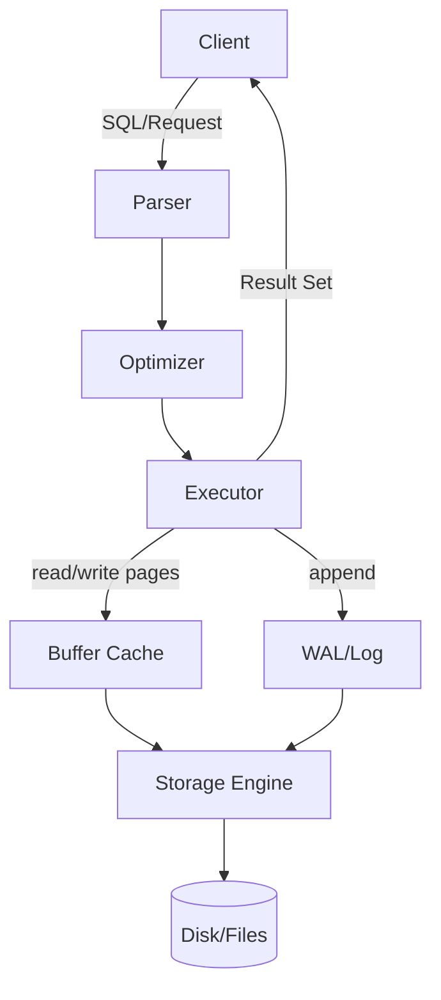
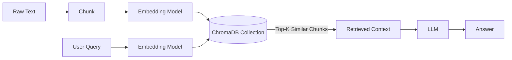

# 数据库、关系型数据库与非关系型数据库（面向初学者）

可以从一个更常见的起点进入问题：`students.csv` 或 `students.xlsx`。

在课程作业的早期阶段，把学生、课程、成绩放进表格文件通常足够。打开文件，改一格，保存，数据就更新了。复制一列，粘贴一列，结构也能快速成型。

但只要系统开始“运行”，表格文件就会暴露它的边界。这里的“运行”，指的是程序持续读写数据，多个用户同时操作数据，并且系统必须在故障后恢复。

首先是写入动作。CSV/XLSX 的写入很容易变成整体重写：改动一行，背后却可能要重写整份文件。结构也容易漂移：今天临时加一列，明天删一列；同一列里混进数字与字符串，后续计算会出现隐性错误。

然后是查询动作。要找“修了数据库且成绩>=90”的学生，程序通常要把文件整体读进内存，再在内存里筛选、拼接、排序。数据量一上来，读取与解析就会拖慢整个流程。

再往后是并发动作。两个人同时打开 Excel 修改，最后保存的人会覆盖前一个人的结果。这个覆盖不是恶意行为，它只是文件模型在并发写入下的自然结果。

最后是故障动作。断电发生在写到一半，文件可能进入损坏状态。恢复过程会退化成“找备份、比对差异、手工修复”。这套流程耗时，也不稳定。

数据库出现，用来把这些动作工程化：让写入可恢复，让查询可优化，让并发可控制，让故障可回放。它不是“更大的文件夹”，而是一套对数据生命周期负责的系统。

## 1. 数据库到底在做什么

数据库的价值，不在于“能存”，而在于“能把存和查做得可控”。它会把数据管理拆成一组明确动作，并为每个动作提供机制与边界。

先看写入路径。写入不是把字节直接塞进磁盘那么简单。数据库通常会先做校验：类型是否匹配，约束是否满足。校验通过后，它会把变更追加到日志里，这条日志常被称为 Write-Ahead Log（WAL），直观理解是“先记账再动仓库”。日志先落下，是为了让崩溃恢复有依据：只要日志在，系统就能把变更重放出来，把状态拉回一致。

日志写完，数据库会把数据页更新到内存缓冲区。这里的“页”可以理解为数据库读写磁盘的基本单位。之后，数据库会在合适时机把脏页刷盘，并用检查点把恢复成本控制在可接受范围内。

再看读取路径。读取同样不是“读文件然后搜索”。数据库会先解析查询，把字符串变成语法结构。接着，优化器会选择执行计划：要不要用索引，先联结哪张表，是否需要排序或哈希。最后，执行器按计划去取数据页，并把结果流回客户端。

下面用一张简化图，把读写的主要信息流固定下来。图里省略了大量细节，但保留了关键组件之间的方向关系。

把这张图与前面的 CSV/XLSX 场景对照，会看到几条清晰目标。

数据库会用索引降低查询成本。理想情况下，查找会从线性扫描变成对数级定位。

数据库会用并发控制避免“读到一半的写入”，也会避免“两个写相互覆盖”。

数据库会用日志与检查点把崩溃恢复变成一条可执行流程，而不是一段手工经验。

有了这个地基，再谈“关系型”和“非关系型”，讨论点就会落在两处：数据模型怎么组织，以及系统把什么查询动作放到中心。

## 2. 关系型数据库：先定结构，再做约束

关系型数据库的基本单位是表。表是一种强结构的承诺：字段名明确，字段类型明确，允许的取值范围也可以被约束。

以选课系统为例，常见拆法是三张表：`students(学号, 姓名, 专业)`、`courses(课程号, 课程名)`、`scores(学号, 课程号, 分数)`。

这里的重点不在“写出三张表”，而在“让关系变成可联结的数据结构”。`scores` 同时引用学生与课程，因此它把“学生-课程-分数”的关系固定成了可计算的连接点。

SQL 在关系型数据库里扮演控制面。它描述结果，而不描述步骤。比如“修了数据库且成绩>=90”的查询，可以被理解为一条动作链：先在成绩表里筛课程号与分数，再把筛出来的学号联结到学生表，最后输出姓名。

联结（JOIN）看起来像语法结构，但在执行层会变成具体策略。策略可以是嵌套循环，也可以是哈希联结，也可以是排序归并联结。不同策略对应不同的数据分布与成本模型。优化器做的事情，就是在这些策略里选一个总体更省的。

关系型数据库把一致性写进语义。事务（Transaction）把一组读写包成一个原子单元。ACID 描述事务应满足的性质：原子性避免“半成功”，一致性保证约束在提交点成立，隔离性让并发看起来像按某种顺序串行执行，持久性保证提交结果在断电后仍可找回。

这些词不需要背成口诀，但需要对齐故障形态。以转账为例，扣款与加款必须同时成立。事务把两个更新绑定在一个提交点上，就把“只扣不加”这类中间态排除掉。

并发控制是关系型数据库的核心难题之一。读写冲突会导致脏读、不可重复读、幻读，写写冲突会导致丢失更新。数据库通常用锁（Lock）或多版本并发控制（MVCC）来处理这些冲突。锁的思路是先占用关键资源再修改，MVCC 的思路是保留旧版本并让读写并行。隔离级别的选择，本质上是在性能与异常之间划边界。

索引是关系型数据库的常用加速器。没有索引时，查找会逼近全表扫描。有索引时，查找会变成在有序结构里定位区间。常见索引结构是 B+ 树，它把磁盘访问次数压到可控范围。粗略理解即可：当数据量为 $n$ 时，查找成本接近 $O(\log n)$，而不是 $O(n)$。

强结构带来清晰，也带来代价。字段变更会触发表结构修改与数据迁移。数据规模跨到多台机器时，跨机联结与跨机事务会变得昂贵。关系型数据库可以做分片、复制与读写分离，但它的成本曲线往往在“单机 + 强事务”附近最漂亮。

典型关系型产品包括 MySQL、PostgreSQL、SQLite。它们定位不同，但共享同一组核心语言：表、约束、事务、SQL。

## 3. 非关系型数据库：先让数据流动，再让结构收敛

非关系型数据库（NoSQL）不是“反对关系”。它更像一次优先级调整：当数据结构变化快，规模增长快，并且分布式不可避免时，系统先保证可扩展与可服务，然后再在一致性与查询能力上做取舍。

分布式系统绕不开一个现实：网络会分区，机器会掉线，延迟会波动。系统需要在一致性（Consistency）、可用性（Availability）、分区容忍（Partition Tolerance）之间做取舍。CAP 更像一张地图。它不替系统做决定，但它迫使系统承认代价存在。

NoSQL 的分类可以从数据模型切开。不同模型把不同查询动作放到中心。

键值数据库把数据压成 `key -> value` 的映射。它把读写动作简化成按键定位，从而换到更低延迟与更高吞吐。缓存、会话、计数器这类场景通常只需要这个动作集合，因此键值库会很常见。

文档数据库把一条记录存成类 JSON 文档。字段可增可减，结构由业务驱动演化。数据库负责存取、索引与查询，应用负责定义字段语义。用户画像、内容系统、实验字段频繁变更的系统往往更容易接受这种模型。

宽列数据库把数据组织成“行键 + 列族”。它把写入与扩展放在更高优先级，并倾向于用可水平扩展的方式承载持续写入压力。它通常不擅长复杂联结，但擅长把写入负载分散到集群。

搜索与分析系统会把倒排索引放到中心，把“文本匹配”变成一等能力。这里的关键不是“能不能存文档”，而是“能不能把词项映射到文档集合，并支持相关性排序与聚合”。

图数据库把实体建成点，把关系建成边。它把“沿关系走一步”作为核心算子，因此适合社交关系、推荐关系、知识图谱。与其在 SQL 里写多层自联结，不如把关系结构交给图模型来执行。

在本课程的语境里，还会遇到一类更贴近后续章节的系统：向量数据库。它把文本或图片编码成向量，并把“相似度检索”做成核心动作。这个动作与传统 SQL 的差异很明显：SQL 更擅长精确匹配与聚合，向量检索更擅长近邻搜索与语义相似。

## 4. 把概念落回本课程：ChromaDB 与非关系型数据库

把视角拉回 `05-chromadb-memory/`。本课程引入 ChromaDB，不是为了替换关系型数据库，而是为了对齐 RAG 的主工作负载。

RAG 的主查询动作通常不是“按主键命中某一行”。它更像“在一堆文本片段里，找出语义最接近问题的那几段”。系统接收用户问题后，会把问题编码成向量。随后，它会在大量向量里做近邻搜索，取回若干候选文本块。最后，它把这些文本块拼成上下文，交给大语言模型（LLM）生成答案。

这条链路的压力点落在召回阶段。召回要解决的不是“能不能算相似度”，而是“能不能在高维空间里快速找到相近向量”。

把 ChromaDB 放进数据库谱系，它更贴近非关系型数据库的思路。差异不在名称，而在数据模型与接口语义。

关系型数据库围绕“表行”和“联结”组织数据。它把精确筛选与聚合作为常见主流程。

ChromaDB 围绕 collection 组织数据。它把一条数据拆成三部分：原文（document）、向量（embedding）、元数据（metadata）。写入动作把三者一并落下。查询动作以向量检索为入口，然后再用元数据做过滤与裁剪。

这个顺序值得停一下。过滤动作看起来像 SQL 的 `WHERE`，但它服务的主流程不同：关系型常见流程是先过滤再联结，向量库常见流程是先近邻再过滤。

这也解释了“为什么不直接用关系型数据库存向量”。关系型数据库当然可以存向量字段，也可以通过扩展提供相似度函数。但它的默认执行模型仍然围绕表扫描、范围索引与联结展开。向量检索的主要成本来自近邻搜索。系统通常需要专门的索引结构与近似算法，把计算量压到可用的延迟区间。ChromaDB 把这条检索路径放到中心，因此更容易对齐 RAG 的调用链路。

把 ChromaDB 与常见 NoSQL 再对齐一次，连接关系会更直观。文档数据库把结构放宽，让字段随业务演化；搜索系统把倒排索引放到中心，让文本匹配可执行；向量数据库把向量索引放到中心，让语义相似可执行。三者共享同一个策略：先确定主查询算子，再围绕算子组织存储与索引。

下面用一张最小数据流图，把 ChromaDB 在 RAG 里的位置固定下来。

最后用一句工程化描述收尾：数据库管理状态；关系型数据库用表结构与事务约束状态；非关系型数据库用特定数据模型与索引路径扩展状态；ChromaDB 把“向量相似度”提升为一等查询算子，从而为 RAG 提供可执行的召回机制。
